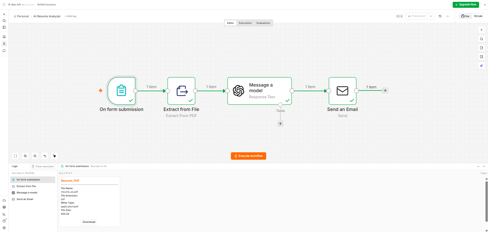
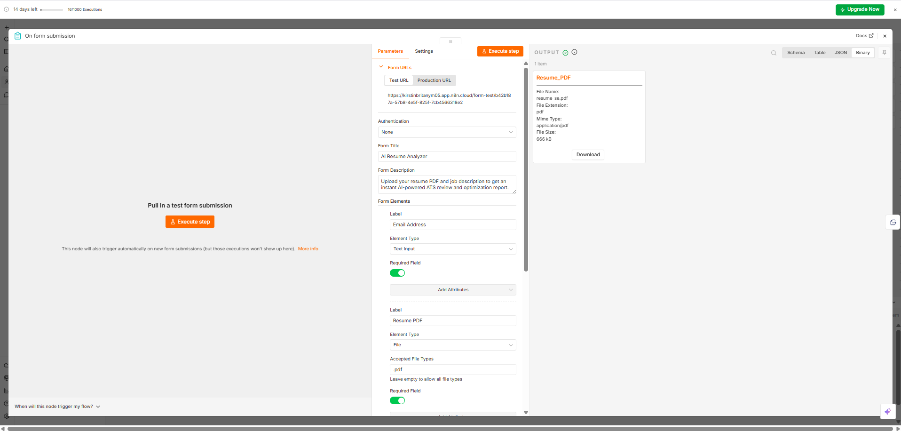
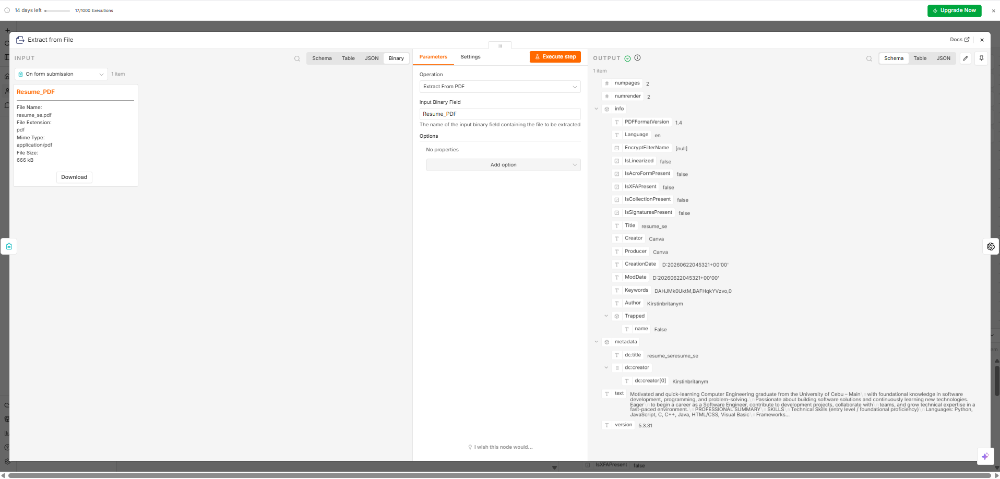
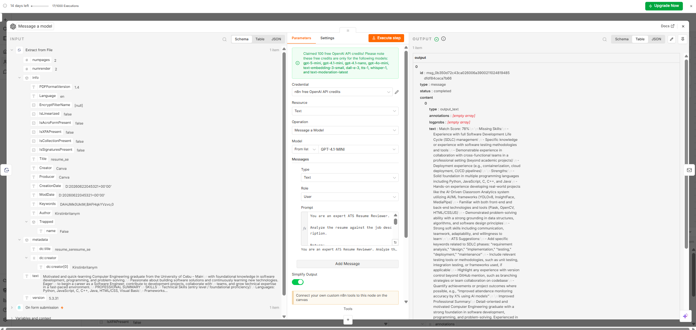
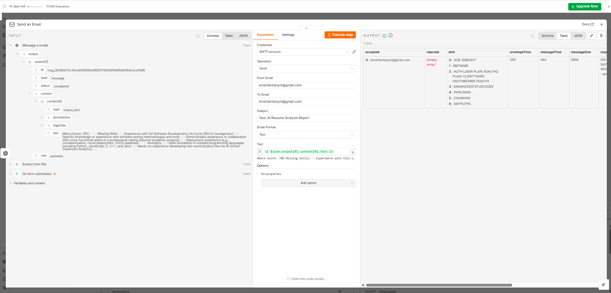
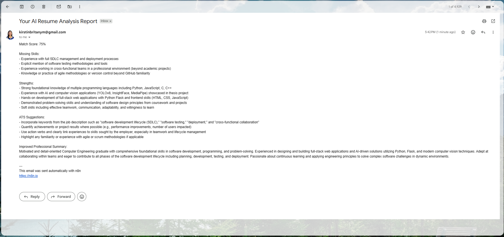

# AI Resume Analyzer

An AI-powered ATS Resume Analyzer built with n8n and OpenAI. Users upload a PDF resume and provide a job description through a web form. The workflow automatically extracts resume content, analyzes ATS compatibility, identifies missing skills, generates improvement recommendations, and emails a personalized report.

## Overview

This project automates the resume screening process by comparing a candidate's resume against a target job description. It helps job seekers improve their resumes and increase their chances of passing Applicant Tracking Systems (ATS).

## Features

* PDF Resume Upload
* Automatic PDF Text Extraction
* AI-Powered ATS Analysis
* Match Score Calculation
* Missing Skills Detection
* Resume Strengths Identification
* ATS Improvement Suggestions
* Improved Professional Summary Generation
* Automated Email Delivery

## Workflow

```text
Resume Upload Form
        ↓
PDF Text Extraction
        ↓
OpenAI GPT-4.1 Mini
        ↓
ATS Analysis Report
        ↓
Email Delivery
```

## Technologies Used

* n8n
* OpenAI GPT-4.1 Mini
* PDF Text Extraction
* SMTP Email
* Form Processing
* Prompt Engineering

## Screenshots

### Workflow Canvas



### Resume Upload Form



### PDF Text Extraction



### OpenAI ATS Analysis



### Email Delivery Setup



### Generated Email Report



## Example Output

The system generates:

* ATS Match Score
* Missing Skills Analysis
* Resume Strengths
* ATS Optimization Suggestions
* Improved Professional Summary

Example:

```text
Match Score: 78%

Missing Skills:
- AWS
- Docker
- Agile Methodologies

Strengths:
- Programming Fundamentals
- Problem Solving
- AI Automation

ATS Suggestions:
- Add relevant cloud technologies
- Include measurable achievements
- Improve keyword alignment
```

## Skills Demonstrated

* AI Automation
* Workflow Development
* Document Processing
* Prompt Engineering
* API Integration
* Email Automation
* Business Process Automation

## Business Value

This automation reduces the time required for resume reviews by automatically analyzing resumes against job requirements and generating actionable feedback. It provides job seekers with instant ATS insights and helps improve resume quality before applying for jobs.

## Future Improvements

* DOCX Resume Support
* Cover Letter Generator
* Multi-Job Comparison
* Resume Scoring Dashboard
* Google Sheets Integration
* Recruiter Review Portal

## Author

**Kirstin Britany**

Computer Engineering Graduate

AI Automation Enthusiast

Building AI-powered workflow automation solutions using n8n and OpenAI.
